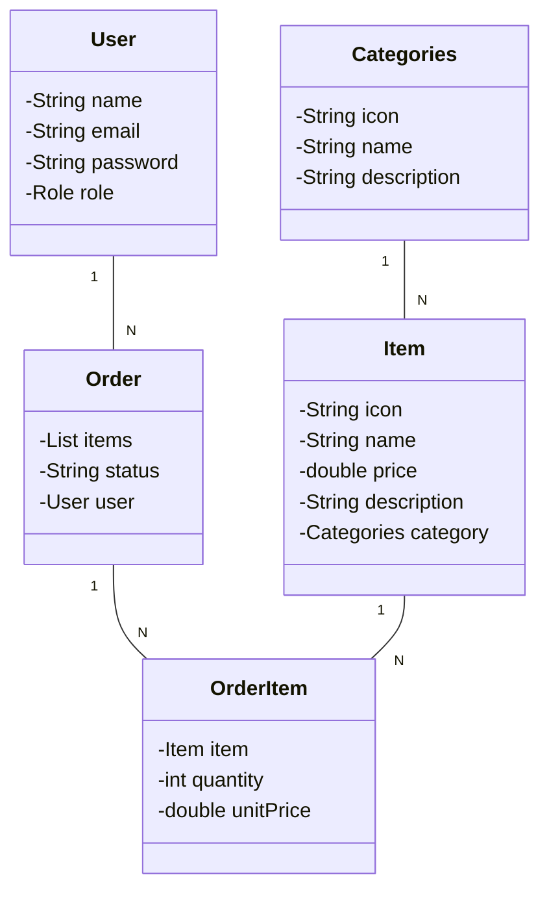

# API REST - Cardápio Digital

Uma API RESTful desenvolvida com Spring Boot para gerenciar um cardápio digital, incluindo usuários, categorias, itens e pedidos.

## 🚀 Tecnologias Utilizadas

- Java 17
- Spring Boot 3.4.4
- Spring Security + JWT
- Spring Data JPA
- PostgreSQL (Produção)
- H2 Database (Desenvolvimento)
- Lombok
- Swagger/OpenAPI
- Maven

## 📋 Funcionalidades

### 🔐 Autenticação
- Registro de usuários
- Login com JWT
- Controle de acesso baseado em roles (ADMIN/CLIENTE)

### 📑 Gerenciamento de Categorias
- CRUD completo de categorias
- Associação com itens do cardápio
- Atributos: ícone, nome e descrição

### 🍽️ Gerenciamento de Itens
- CRUD completo de itens do cardápio
- Vinculação com categorias
- Atributos: nome, preço, descrição e ícone

### 🛒 Gerenciamento de Pedidos
- Criação e acompanhamento de pedidos
- Múltiplos itens por pedido
- Status de acompanhamento
- Vinculação com usuário

## 🏗️ Estrutura do Projeto

```
projeto-api-rest/
├── src/main/java/
│   └── projeto/dio/projeto_api_rest/
│       ├── configuration/    # Configurações (Security, etc)
│       ├── controller/      # Endpoints da API
│       ├── domain/         
│       │   ├── model/      # Entidades
│       │   └── repository/ # Interfaces JPA
│       ├── DTO/            # Objetos de Transferência
│       └── service/        # Lógica de Negócio
└── resources/
    └── application.properties
```

## 📊 Diagrama de Classes



## 🔧 Configuração

### Perfis Disponíveis
- **dev**: Utiliza banco H2 em memória
- **prod**: Utiliza PostgreSQL

### Propriedades Principais
```properties
# Banco de Dados
spring.datasource.url=jdbc:postgresql://seu-banco/nome-banco
spring.datasource.username=seu-usuario
spring.datasource.password=sua-senha

# JPA/Hibernate
spring.jpa.hibernate.ddl-auto=create
spring.jpa.show-sql=true

# Swagger/OpenAPI
springdoc.swagger-ui.path=/swagger-ui.html
```

## 🔒 Segurança

- Autenticação baseada em JWT
- Roles: ADMIN e CLIENTE
- Endpoints protegidos por autorização
- Senha criptografada com BCrypt

## 📝 Endpoints Principais

### Autenticação
```
POST /auth/register - Registro de usuário
POST /auth/login   - Login e geração de token
```

### Usuários
```
GET    /users      - Lista todos usuários
GET    /users/{id} - Busca usuário por ID
PUT    /users/{id} - Atualiza usuário
DELETE /users/{id} - Remove usuário
```

### Categorias
```
POST   /categories     - Cria categoria
GET    /categories    - Lista categorias
GET    /categories/{id} - Busca categoria
PUT    /categories/{id} - Atualiza categoria
DELETE /categories/{id} - Remove categoria
```

### Itens
```
POST   /items     - Cria item
GET    /items    - Lista itens
GET    /items/{id} - Busca item
PUT    /items/{id} - Atualiza item
DELETE /items/{id} - Remove item
```

### Pedidos
```
POST   /orders     - Cria pedido
GET    /orders    - Lista pedidos
GET    /orders/{id} - Busca pedido
GET    /orders/my   - Pedidos do usuário autenticado
PUT    /orders/{id} - Atualiza pedido
DELETE /orders/{id} - Remove pedido
```

## 🚀 Como Executar

1. Clone o repositório
2. Configure o banco de dados em `application.properties`
3. Execute usando Maven:

```bash
./mvnw spring-boot:run
```

## 📚 Documentação

A documentação completa da API está disponível via Swagger UI:
```
http://localhost:8080/swagger-ui.html
```

## 🤝 Contribuições

Contribuições são bem-vindas! Sinta-se à vontade para:

1. Fazer um fork do projeto
2. Criar uma branch para sua feature (`git checkout -b feature/AmazingFeature`)
3. Commit suas mudanças (`git commit -m 'Add AmazingFeature'`)
4. Push para a branch (`git push origin feature/AmazingFeature`)
5. Abrir um Pull Request
